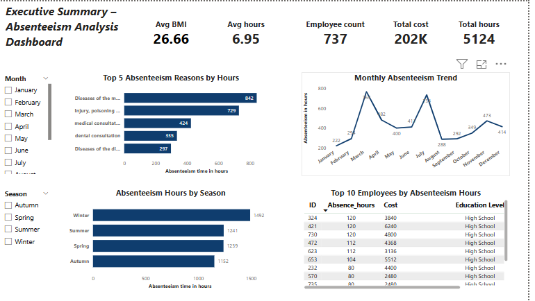
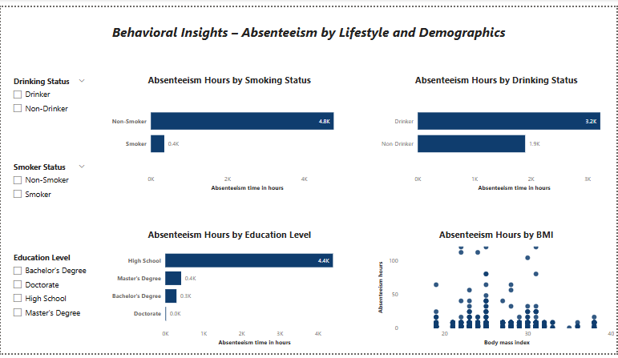
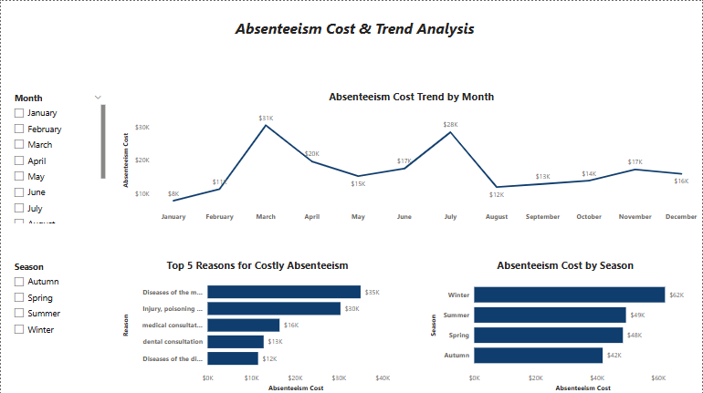

# 📊 Power BI Project: Employee Absenteeism Behavior and Cost Analysis

---

## 🔺 Executive Summary

This Power BI dashboard analyzes employee absenteeism data to uncover behavioral patterns, cost drivers, and time trends.  
The goal is to empower HR decision-makers to understand **why, when, and how employees are absent**, and what **impact it has on the organization**.

---

## 🔹 Key Insights

- **Smoking behavior is a major driver of absenteeism**  
  Employees who smoke accounted for **4,773 hours** absent, compared to only **351 hours** among non-smokers — over **13x higher**.

- **Social drinking correlates with higher absenteeism**  
  Drinkers missed **3,226 hours**, nearly double the **1,898 hours** recorded by non-drinkers.

- **Absenteeism peaks in March and July**  
  March (**765 hrs**) and July (**734 hrs**) had the highest recorded absences, likely tied to seasonal or health patterns.

- **Cost trends mirror absenteeism peaks**  
  March (**KES 31k**) and July (**KES 28k**) had the highest absenteeism-related costs, highlighting financial implications.

- **Top 5 reasons account for most absentee cases**  
  1. Musculoskeletal diseases  
  2. Injury and poisoning  
  3. Medical consultation  
  4. Dental consultation  
  5. Digestive system diseases

- **Lower-educated employees dominate absentee cases**  
  Among the top 10 most absent employees, **9 had only high school education**, and only **1 had a master's degree**.

---

## ⚙️ Project Details

### 📁 Dataset Overview

The dataset includes three related tables:

| Table Name     | Description |
|----------------|-------------|
| `Absenteeism`  | Main fact table capturing absence events and employee demographics |
| `Reasons`      | Lookup table mapping numeric codes to medical absence reasons |
| `Compensation` | Hourly wage per employee, used to compute absenteeism cost |

---

### 🛠 Tools & Techniques Used

- **Power BI Desktop**: Data modeling, DAX measures, interactive visuals
- **Power Query**: Merges, derived columns, data cleaning
- **Data Relationships**:
  - One-to-many join between `Reasons` and `Absenteeism`
  - One-to-one join between `Compensation` and `Absenteeism`
- **Custom Columns**:
  - `Season Description` (1 = Winter, etc.)
  - `Month Name` (sorted by `Month Number`)
  - `Education Level`
  - `Smoking Status` and `Drinking Status`
- **DAX Measures**:
  - Total Absenteeism Hours
  - Total Absenteeism Cost
  - Average Hours per Employee

---
## 🔍 Dashboard Previews

### 📄 Page 1 – Executive Summary

### 📄 Page 2 – Behavioral & Demographic Insights

### 📄 Page 3 – Cost & Trend Analysis

## 📊 Dashboard Overview

### 🟩 Page 1 – Executive Summary
- KPI Cards: Total Hours, Total Cost, Avg Hours/Employee
- Bar Chart: Absenteeism by Top Reasons
- Line Chart: Absenteeism Trend by Month
- Table: Top 10 Absent Employees
- Slicers: Month Name, Season Description

### 🟨 Page 2 – Behavioral & Demographic Insights
- Bar Chart: Smoking Status vs Absenteeism Hours
- Bar Chart: Drinking Status vs Absenteeism Hours
- Bar Chart: Absenteeism by Education Level
- Scatter Plot: BMI vs Absenteeism Hours
- Slicers: Smoking, Drinking, Education

### 🟦 Page 3 – Cost & Trend Analysis
- Line Chart: Cost by Month
- Bar Chart: Cost by Top 5 Reasons
- Bar Chart: Cost by Season
- Slicers: Month Name, Season Description

---

## 🧮 Key Measures

| Measure                        | Description |
|-------------------------------|-------------|
| `Total Absenteeism Hours`     | Sum of `Absenteeism time in hours` |
| `Total Absenteeism Cost`      | Product of hours × hourly comp |
| `Avg Hours per Employee`      | Total hours / unique employee count |
| `Smoking/Drinking Status`     | Derived from 1/0 columns for clear visuals |

---
## 📢 Recommendations

Based on the insights derived from the absenteeism data, the following actions are recommended:

- **Implement targeted health programs**  
  Smoking and drinking behaviors are strongly associated with high absenteeism. The organization should consider offering wellness campaigns, support groups, and health incentives to reduce lifestyle-related absences.

- **Focus on ergonomic and physical wellness initiatives**  
  Musculoskeletal issues were the leading cause of absence. HR should invest in ergonomic assessments, posture training, and physical wellness programs to prevent such conditions.

- **Address peak absenteeism periods with resource planning**  
  March and July had the highest absenteeism and cost. These months should be flagged for workforce planning and temporary staffing support.

- **Monitor and support lower-educated staff more closely**  
  High absenteeism among employees with only a high school education suggests a potential skills, engagement, or awareness gap. Consider additional training, mentorship, or performance support for this group.

- **Track and investigate high-cost reasons**  
  Diseases, injuries, and consultations account for most costs. A root cause review of workplace conditions, insurance access, or work-life balance policies could yield further insights.

- **Promote early intervention**  
  Since absenteeism spikes might be predictable, HR could set up alerts or nudges when employees begin to show early signs (like short frequent absences) and intervene early.
---

## 📂 What’s Included

- [`README.md`](./README.md) – Project documentation  
- [`Absenteeism analysis.pbix`](./Absenteeism%20analysis.pbix) – Power BI report file 
- 📸 Report Screenshots:  
  - [Page 1 – Executive Summary](./page1.png)  
  - [Page 2 – Behavioral & Demographic Insights](./page2.png)  
  - [Page 3 – Cost & Trend Analysis](./page3.png)

  

